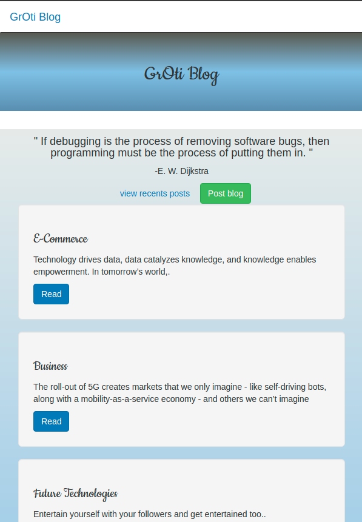

# GrotiBlog
#### Created in sep 27, 2021
#### By **Grievin Otieno**
## Description
Groti Blog is an application that allows a user to view blogs, login and create a blog and comment on various blog posts that are created by the writer u.

## Setup/Installation Requirements
* Git
* Chrome or any other Browser of your choice
* Python 3.8
* Pip
* Github
* Flask version 1.1.2

## Setup Installation
* Fork this repository
* Copy the code and clone it to your Command line
* cd to that directory
* activate the virtual environment by:

python3.8 -m venv venv

source venv/bin/activate

pip install -r requirements.txt

pip install -r requirements.txt

chmod a+x start.sh 

./start.sh

* Navigate to your browser on http://127.0.0.1:5000/ to view the app

## Known Bugs
import different styling changes making the site different locally from hosted one... will fix it in the near future
## Technologies used
* Flask
* Python
* Postgres SQL
* HTML
* CSS

## Preview of the app
* This is how the app looks like in your machine

* Blogs posted

* Sign- in

* Sign-up

* Phone responsiveness

* 

## Support and contact detail
You can always contribute  To the code or you can contact me @ +254714880548 or email me @ enogroti@gmail.com
### License
MIT
Copyright (c) 2021 **Grievin Otieno**
